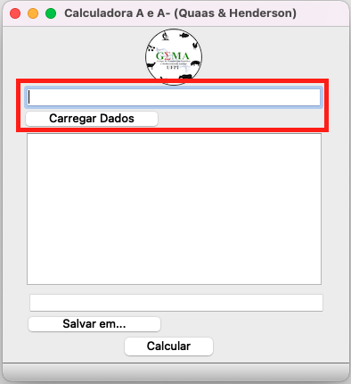
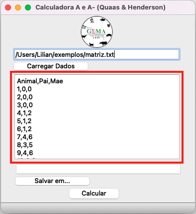
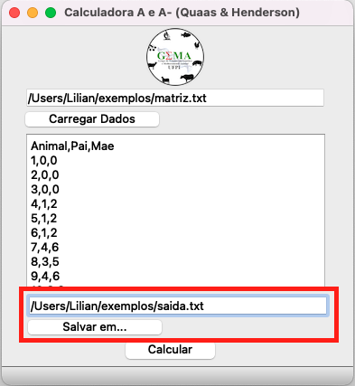
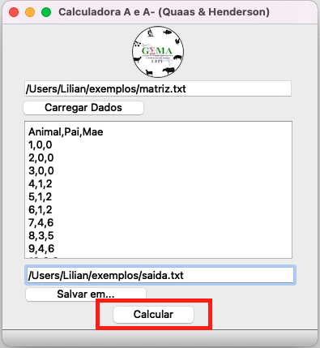

# GEMA CALCULATOR

<figure>

</figure>

### Criação

O software “GEMA CALCULATOR” foi idealizado a partir da disciplina MODELOS MISTOS APLICADO AO MELHORAMENTO ANIMAL, ministrada pelo Professor Doutor José Lindenberg Rocha Sarmento na UNIVERSIDADE FEDERAL DO PIAUÍ (UFPI).

Sobre a escolha do nome do software, trata-se de uma homenagem ao “Grupo de Estudos em Genética e Melhoramento Animal “GEMA”, também coordenado pelo Doutor Lindenberg.  

O software foi criado em linguagem de programação Python, e desta forma pode ser executado em qualquer sistema operacional, incluindo Windows, Linux e MacOS. No entanto para que o mesmo consiga executado é necessário a instalação da versão 3 da  linguagem de programação Python no seu computador.

### Qual a função do  software “GEMA CALCULATOR”?

Esta primeira versão do software permite obter a matriz dos numeradores dos coeficientes de parentesco e sua inversa utilizando as regras do Henderson e Quaas;
As regras de Henderson e Quaas consistem em varias condições a serem verificadas e atendidas para que se possa calcular e montar a matriz de parentesco. Devida a numerosa quantidades de etapas necessárias para montar a matriz, o cálculo manual pode torna-se exaustivo conforme o tamanho do banco de dados, daí a ideia de automatizar o processo. 

### Executar o GEMA CALCULATOR

O GEMA CALCULATOR foi desenvolvido na linguagem de programação Python, dessa forma é possível executá-lo em qual sistema operacional que possua a linguagem Python.

#### Instalar o Python

1) Caso ainda não possua o Python será necessário realizar a instalação, recomendamos a instalação do [Anaconda](https://www.anaconda.com/products/individual) pois essa distribuição já possui todas os pacotes necessários.

2) Caso já possua o [Python](https://www.python.org/downloads/) instalado em sua máquina, basta instalar os seguintes pacotes direto no terminal:

`$ pip install PyQt5`

`$ pip install numpy`

3) Após isso, faça o download do código fonte na sua máquina utilizando [esse link](https://codeload.github.com/romuere/gemaCalculator/zip/refs/heads/master) ou em `Code` -> `Download Zip`.

4) O passo seguinte é descompatar o arquivo Zip.

5) Abra o terminal na pasta criada após a descompactação e entre na pasta `gemaCalculator` (nesta pasta existe um arquivo chamado `gemaCalculator.py`).

6) Execute o arquivo `gemaCalculator.py`:

`$ python gemaCalculator.py`

### Instruções de uso

- Etapa 1. Para utilizar o software é necessário inserir um banco dados.

<figure>

</figure>

- Etapa 2. Com o banco de dados inserido o usuário poderá visualizá-lo na interface do software.

<figure>

</figure>

- Etapa 3. O usuário deve escolher o local onde irá salvar o arquivo de saída. Obs.: O usuário poderá renomear o arquivo de saída.

<figure>

</figure>

- Etapa 4. Feito isso, o usuário deverá clicar no botão “Calcular”. O passo a passo dos cálculos das regras de Henderson e Quaas, para calcular a matriz de parentesco e sua inversa, serão salvos no arquivo de saída.

<figure>

</figure>

### Desenvolvedores

[Lilian Rosalina Gomes Silva](http://lattes.cnpq.br/5441457629307443)

[Romuere Rodrigues Veloso e Silva](http://lattes.cnpq.br/3734588405818556)

[José Lindenberg Rocha Sarmento](http://lattes.cnpq.br/1991742176699922)

Sandra Isabel Castañeda Caguana 

[Maurício dos Santos Araújo](http://lattes.cnpq.br/4799904442791081)

MIT License

Copyright (c) 2021 Romuere Silva

Permission is hereby granted, free of charge, to any person obtaining a copy
of this software and associated documentation files (the "Software"), to deal
in the Software without restriction, including without limitation the rights
to use, copy, modify, merge, publish, distribute, sublicense, and/or sell
copies of the Software, and to permit persons to whom the Software is
furnished to do so, subject to the following conditions:

The above copyright notice and this permission notice shall be included in all
copies or substantial portions of the Software.

THE SOFTWARE IS PROVIDED "AS IS", WITHOUT WARRANTY OF ANY KIND, EXPRESS OR
IMPLIED, INCLUDING BUT NOT LIMITED TO THE WARRANTIES OF MERCHANTABILITY,
FITNESS FOR A PARTICULAR PURPOSE AND NONINFRINGEMENT. IN NO EVENT SHALL THE
AUTHORS OR COPYRIGHT HOLDERS BE LIABLE FOR ANY CLAIM, DAMAGES OR OTHER
LIABILITY, WHETHER IN AN ACTION OF CONTRACT, TORT OR OTHERWISE, ARISING FROM,
OUT OF OR IN CONNECTION WITH THE SOFTWARE OR THE USE OR OTHER DEALINGS IN THE
SOFTWARE.

